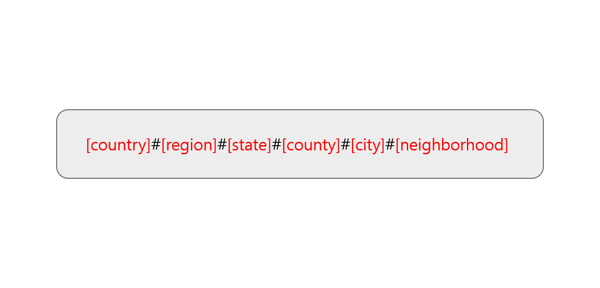
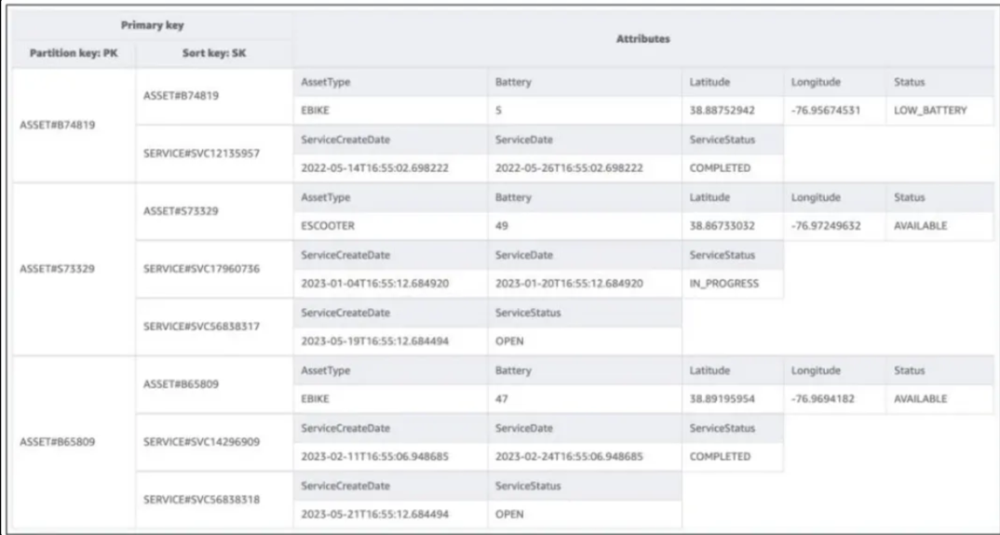
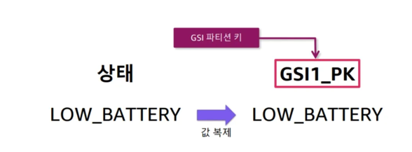
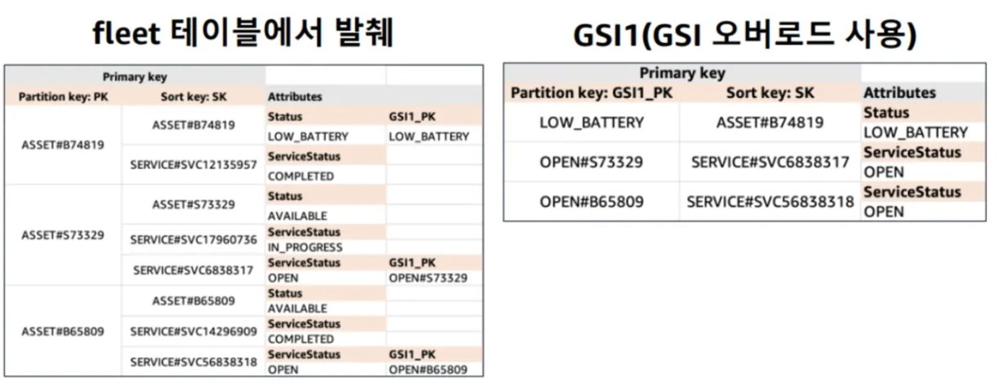

# 사전준비

aws-cli 로컬 구성 필요

# 참고 문서

* AWS DynamoDB 개발자 가이드 (공홈문서)
    * https://docs.aws.amazon.com/ko_kr/amazondynamodb/latest/developerguide/Introduction.html
    * 옵션 설명은 공홈 문서 참고

# 시작하기

```bash
docker compose up -d
```

# 개요

지쿠터, 카카오바이크 같은 전기자전거 대여 서비스를 간단하게 다이나모 디비로 구현해본다.

# 테이블 생성

전기자전거 집합체 테이블 생성

```
aws dynamodb create-table \
  --endpoint-url http://localhost:8000 \
  --table-name fleet \
  --attribute-definitions \
      AttributeName=PK,AttributeType=S \
      AttributeName=SK,AttributeType=S \
  --key-schema \
      AttributeName=PK,KeyType=HASH \
      AttributeName=SK,KeyType=RANGE \
  --provisioned-throughput ReadCapacityUnits=1,WriteCapacityUnits=1
```

## Sort Key Design


AWS에서 권장하는 정렬키 설계 모범 예시

정렬 키로 선택/범위 연산이 가능하기 때문에 데이터를 계층적으로 설계하여 해당 계층에 맞는 데이터를 가져올 수 있음.

이렇게 적용하면 지리적 위치를 큰 범위부터 작은 범위로 계층적으로 나열하기 때문에 country부터 neighborhood 까지의 데이터를 효과적으로 범위 쿼리할 수 있게됨

정렬키는 선택, 범위 연산인 >,>=,<,<=,begin_withs,between 연산이 가능

## fleet table


{접두사}#{id}

* 파티션키: ASSET#B123
    * 자산 접두사: ASSET
* 정렬키: ASSET#B123, SERVICE#SVC123
    * 자산 정렬키의 접두사: ASSET
    * 서비스 항목 정렬키의 접두사: SERVICE

# GSI 생성

```
aws dynamodb update-table \
  --endpoint-url http://localhost:8000 \
  --table-name fleet \
  --attribute-definitions \
    AttributeName=GSI1_PK,AttributeType=S \
    AttributeName=SK,AttributeType=S \
  --global-secondary-index-updates '[
    {
        "Create": {
            "IndexName": "GSI1",
            "KeySchema": [
                {
                    "AttributeName": "GSI1_PK",
                    "KeyType": "HASH"
                },
                {
                    "AttributeName": "SK",
                    "KeyType": "RANGE"
                }
            ],
            "Projection": {
                "ProjectionType": "ALL"
            },
            "ProvisionedThroughput": { 
			  "ReadCapacityUnits": 1,
			  "WriteCapacityUnits": 1
			  }
        }
    }
]
'
```

ProjectionType은 인덱스에 어떤 정보를 저장할지 지정하는 옵션

* ALL : 모든 속성
* KEYS_ONLY : 키만 포함
* INCLUDE : 일부 속성만 포함

## 해결하려는 액세스 패턴

**이용자**는 이용 중인 자전거 하나만
**관리자**는 모든 자전거에 대해 배터리 정보를 궁금해함

배터리 정보는 파티션키도, 정렬키도 아님 or 상태가 OPEN인 항목만 가져오고 싶음
SCAN해서 모든 테이블의 데이터를 검색 → 많은 비용 발생, 지양해야함

GSI 2개 생성 필요, 하지만 GSI는 최대 20개만 만들 수 있으므로 GSI 생성은 신중해야 한다.

-> `GSI Sparse Index`, `GSI 오버로딩`을 통해 GSI 한 개만 생성해서 두가지 액세스 패턴 모두 만족하자

## GSI Sparse Index


상태가 LOW_BATTERY인 경우에만 속성을 추가한다. 충전을 완료할 경우 속성을 제거한다.

- 값이 있는 경우에만 데이터를 가져오므로 글로벌 보조 인덱스 사이즈가 줄음 → 비용절감
    - 이경우 sparse index라고 함

## GSI 오버로딩

여러 항목 유형의 공통 속성을 인덱싱해 가급적 GSI를 신규 생성하지 않고 기존 인덱스를 사용하는 방식


배터리 부족 액세스 패턴과 미해결 서비스 주문 액세스 패턴은 공통 특성을 공유한다.
우리가 원하는 것은 작은 항목 하위 집합의 레코드만 반환하는 것

애플리케이션 레벨에서 fleet 테이블의 GSI1_PK 컬럼에 데이터를 써주고 그걸 GSI1 에서 파티션 키로 씀

# 정보 조회

## 테이블 목록 조회

```
aws dynamodb list-tables --endpoint-url http://localhost:8000
```

## 테이블 정보 조회

```
aws dynamodb describe-table --table-name fleet  --endpoint-url http://localhost:8000
```

## LOW_BATTERY 항목 조회

### 테이블에서 스캔해서 LOW_BATTERY 항목 가져오기

```
aws dynamodb scan \
  --endpoint-url http://localhost:8000 \
  --table-name fleet \
  --filter-expression "GSI1_PK = :pk" \
  --expression-attribute-values '{ ":pk": { "S": "LOW_BATTERY"}}' \
  --return-consumed-capacity TOTAL \
  --select COUNT
```

### GSI Sparse Index 통해 LOW_BATTERY 항목 조회

```
aws dynamodb query \
  --endpoint-url http://localhost:8000 \
  --table-name fleet \
  --index-name GSI1 \
  --key-condition-expression "GSI1_PK = :pk" \
  --expression-attribute-value '{ ":pk": { "S": "LOW_BATTERY"}}' \
  --return-consumed-capacity TOTAL \
  --select COUNT
```

## 자산의 미해결 항목 찾기

특정 파티션(ASSET#특정항목) 내 SERVICE#로 시작하는 정렬키 항목들

```
PK: ASSET#특정항목id
SK: begins with SERVICE#
ServiceStatus: "OPEN"
```

### 테이블 스캔

```
aws dynamodb query \
  --endpoint-url http://localhost:8000 \
  --table-name fleet \
  --key-condition-expression "PK = :pk and begins_with(SK, :sk)" \
  --filter-expression "ServiceStatus = :servicestatus" \
  --expression-attribute-values '{":pk": { "S": "ASSET#...."}, ":sk": { "S": "SERVICE#" },":servicestatus": { "S": "OPEN"} }' \
  --query 'Items'
```

### GSI 인덱스 쿼리

```
aws dynamodb query \
  --endpoint-url http://localhost:8000 \
  --table-name fleet \
  --index-name GSI1 \
  --key-condition-expression "GSI1_PK = :gsi1_pk" \
  --expression-attribute-values '{":gsi1_pk":{"S":"OPEN#S76438"}}' \
  --query 'Items'
```